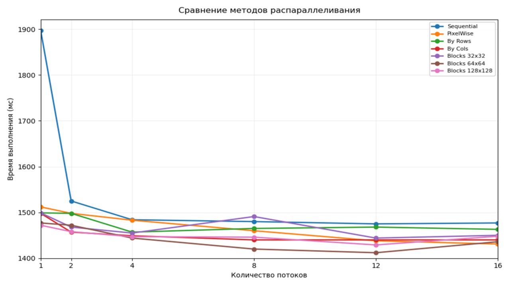
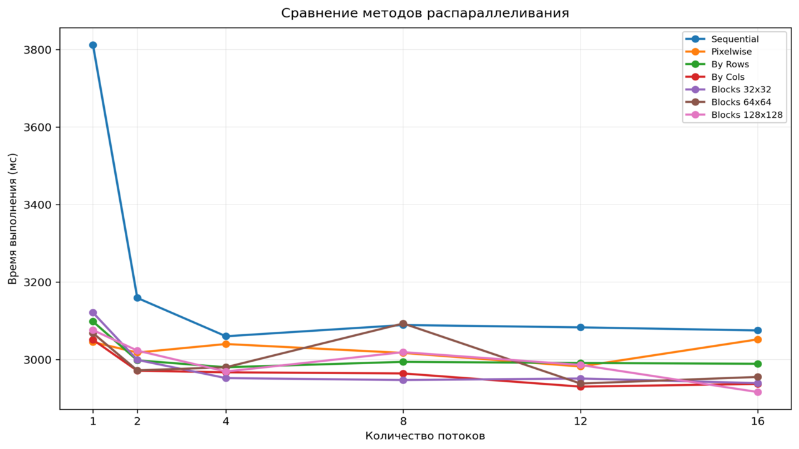
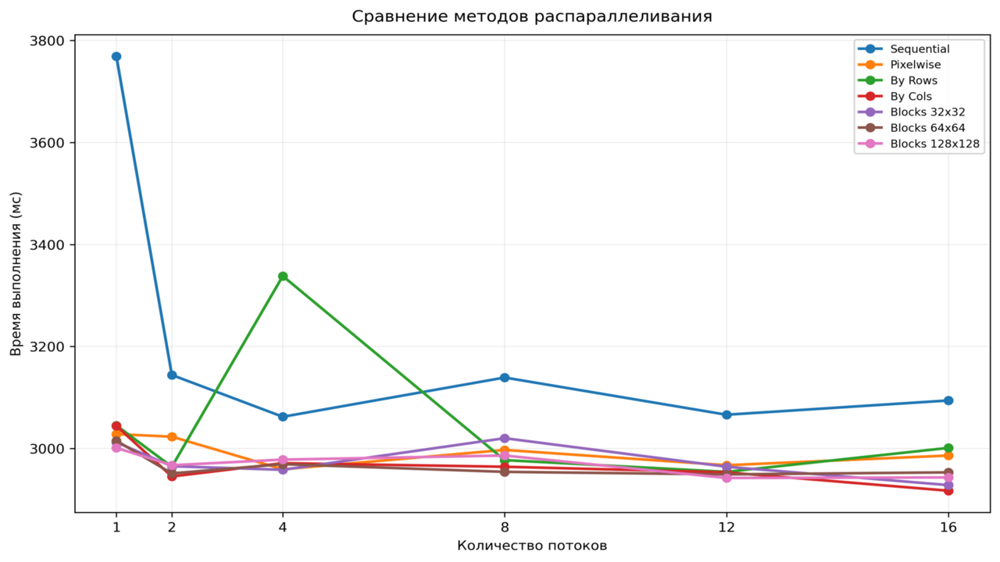
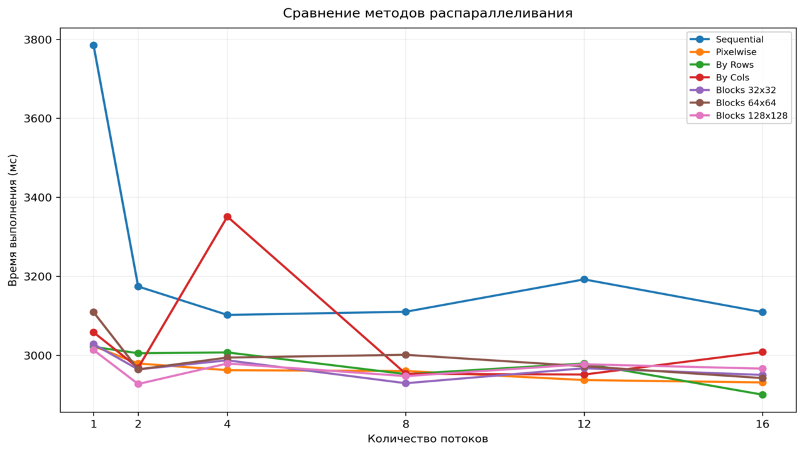
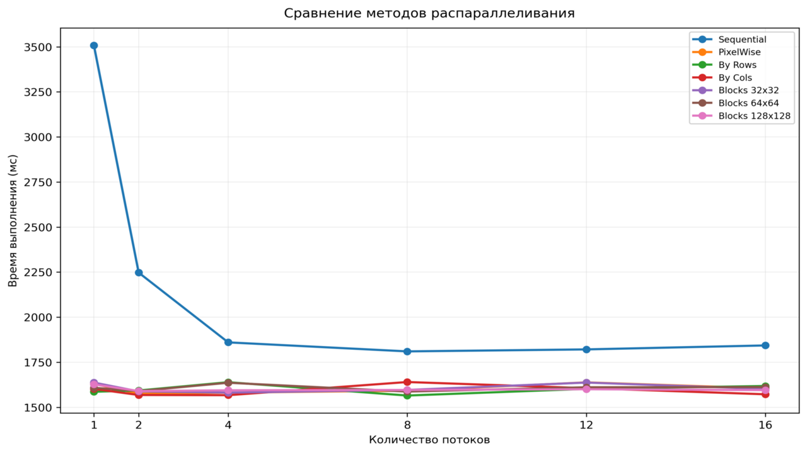
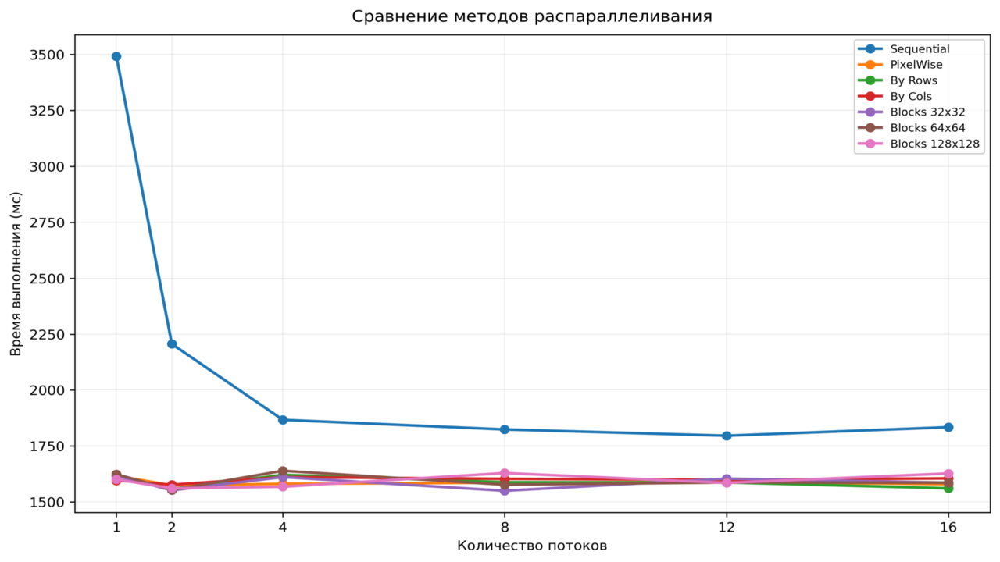
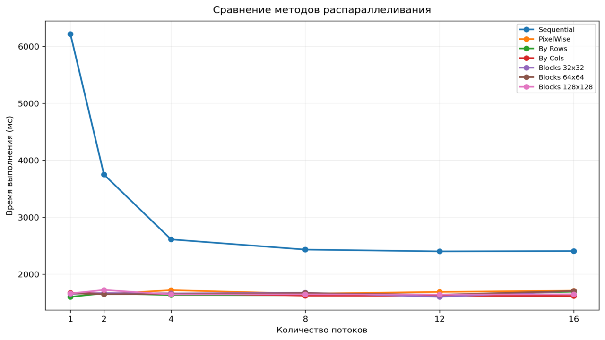
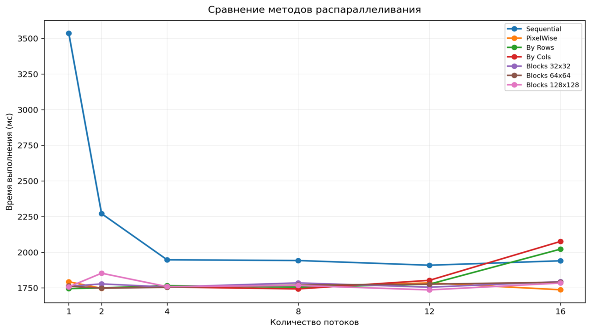
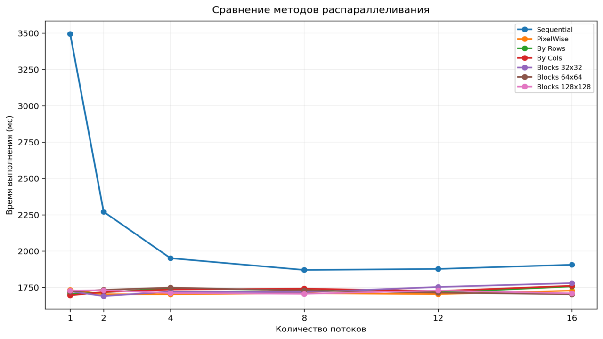
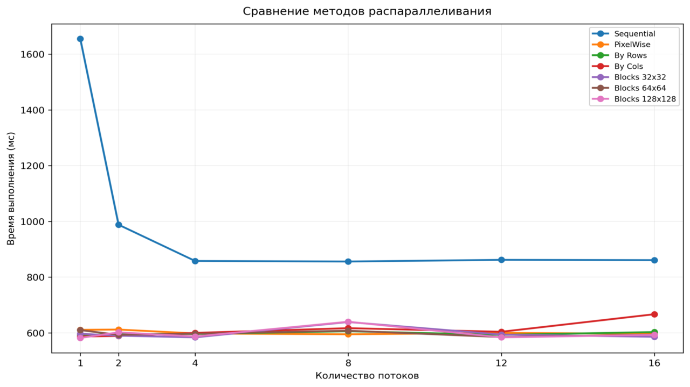

# Convolution Image Filtering (C)

Проект реализует **ручную свёртку (convolution)** для фильтрации изображений на языке C с использованием OpenCV.  
Позволяет применять различные фильтры и тестировать производительность **конвейерной (pipeline) обработки** множества изображений.

---

## Зависимости

Перед сборкой убедитесь, что установлена следующая библиотека:

| Библиотека | Назначение | Сборка |
|------------|------------|---------------------------|
| OpenCV 3.4 | Работа с изображениями через C API | [Инструкция по сборке](https://gist.github.com/ntcuong777/081276a4d609ddfcdc7d139ad02206f9) |

---

## Сборка и запуск (Makefile)

Проект использует `make` для сборки.

### Доступные цели

| Команда | Описание |
|---------|----------|
| `make build` | скомпилировать основную программу |
| `make test` | скомпилировать и запустить тесты |
| `make clean_images` | очистить папку `new_images/` |
| `make clean` | удалить папку `build/` |

### Аргументы командной строки

| Флаг | Длинная форма | Описание | Пример |
|------|---------------|----------|--------|
| `-f` | `--filter` | ID фильтра (0-14) | `-f 2` |
| `-t` | `--tactic` | Стратегия параллелизации (0-5) | `-t 1` |
| `-i` | `--input` | Входная директория с изображениями | `-i images/` |
| `-o` | `--out` | Выходная директория для результатов | `-o results/` |
| `-w` | `--workers` | Количество потоков-воркеров | `-w 4` |

### ID фильтров

| ID | Фильтр | Описание |
|----|--------|----------|
| 0 | `blur3x3` | Размытие 3×3 (крест) |
| 1 | `blur5x5` | Размытие 5×5 (ромб) |
| 2 | `gaussian3x3` | Гауссово размытие 3×3 |
| 3 | `gaussian5x5` | Гауссово размытие 5×5 |
| 4 | `motionblur` | Размытие в движении 9×9 |
| 5 | `findedges1` | Детектор границ (вертикальный) |
| 6 | `findedges2` | Детектор границ (усиленный) |
| 7 | `findedges3` | Детектор границ (диагональный) |
| 8 | `findedges4` | Детектор границ (Лапласиан) |
| 9 | `sharpen1` | Повышение резкости 3×3 |
| 10 | `sharpen2` | Повышение резкости 5×5 |
| 11 | `sharpen3` | Повышение резкости (инверсия) |
| 12 | `emboss1` | Тиснение 3×3 |
| 13 | `emboss2` | Тиснение 5×5 |
| 14 | `identity` | Тождественный фильтр (без изменений) |

### Стратегии параллелизации

| ID | Стратегия | Описание |
|----|-----------|----------|
| 0 | `sequential` | Последовательная обработка |
| 1 | `pixelwise` | Попиксельное распределение |
| 2 | `by_rows` | Разделение по строкам |
| 3 | `by_cols` | Разделение по столбцам |
| 4 | `blocks_32` | Блоки 32×32 |
| 5 | `blocks_64` | Блоки 64×64 |
| 6 | `blocks_128` | Блоки 128×128 |

### Конвейерная обработка

Проект реализует конвейер для потоковой обработки массива изображений. В отличие от последовательной обработки, где каждое изображение полностью загружается, фильтруется и сохраняется перед переходом к следующему, конвейер разделяет процесс на три независимых этапа: чтение, обработку и запись. Эти этапы работают параллельно, что позволяет эффективно использовать ресурсы многоядерного процессора и сокращает общее время обработки набора изображений.

Такой подход особенно эффективен при обработке большого количества изображений или при работе с вычислительно сложными фильтрами, где основное время занимает свёртка. Кроме того, ограниченный размер очередей предотвращает неконтролируемый рост потребления памяти.

### Пример сборки и запуска

```bash
# Клонирование репозитория
git clone https://github.com/Life-enjoyer7/parallel-convolution-Life-enjoyer7
cd parallel-convolution-Life-enjoyer7

# Сборка основной программы
make build

# Запуск конвейера (обработка всех изображений из папки images/)
./build/filter -f 2 -t 1 -i images/ -o results/ -w 4

# Сборка и запуск тестов
make test

```
 
 ---


## Тестовое окружение

Все замеры производительности выполнены на следующей конфигурации:

| Параметр | Значение |
|----------|----------|
| **CPU** | 13th Gen Intel® Core™ i7-13620H |
| **Ядра / потоки** | 10 ядер / 16 потоков |
| **Оперативная память** | 16 ГБ |
| **L1 кэш (данные)** | 416 КБ (10 экземпляров) |
| **L1 кэш (инструкции)** | 448 КБ (10 экземпляров) |
| **L2 кэш** | 9.5 МБ (7 экземпляров) |
| **L3 кэш** | 24 МБ (1 экземпляр) |
| **Кэш-линия** | 64 байта |
| **Операционная система** | Linux 6.17.0-22-generic |
| **Компилятор** | g++ (Ubuntu 13.3.0-6ubuntu2~24.04.1) 13.3.0|


## Бенчмарки


### Тест 1: Identity Filter

*Сравнение производительности семи стратегий параллелизации при применении тождественного фильтра (без изменений).*



---

### Тест 2: Shift Composition

*Композиция противоположных сдвигов (вправо/влево, вверх/вниз, по диагонали) — каждый тест должен возвращать исходное изображение.*

#### Сдвиг вправо-влево (Right-Left)



#### Сдвиг вверх-вниз (Up-Down)



#### Сдвиг по диагонали (Diag)



---

### Тест 3: Zero Padding

*Сравнение производительности при использовании padded-фильтров (расширение нулями) для пяти различных типов фильтров.*

#### Размытие 3×3 (Blur 3x3)



#### Гауссово размытие 3×3 (Gaussian 3x3)



#### Детектор границ 5×5 (Find Edges 1)



#### Повышение резкости 3×3 (Sharpen 1)



#### Тиснение 3×3 (Emboss 1)



---

### Тест 4: Zero Filter

*Применение нулевого фильтра (все пиксели становятся чёрными).*



