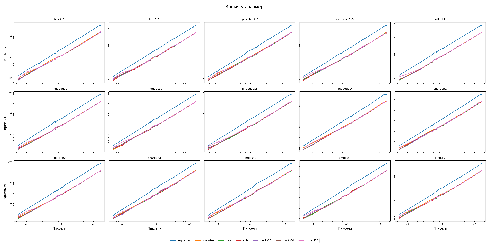
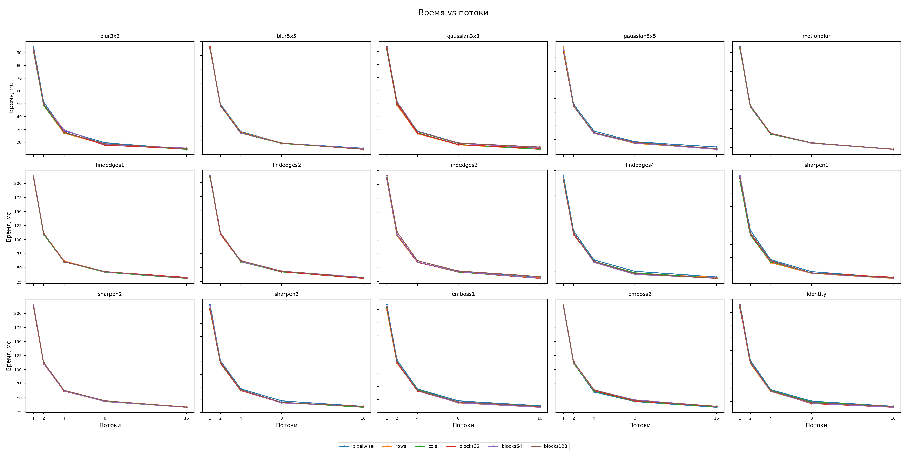

# Convolution Image Filtering (C)

Проект реализует **ручную свёртку (convolution)** для фильтрации изображений на языке C с использованием OpenCV.  
Позволяет применять различные фильтры и тестировать производительность **параллельных стратегий** обработки.

---

## Зависимости

Перед сборкой убедитесь, что установлена следующая библиотека:

| Библиотека | Назначение | Сборка |
|------------|------------|---------------------------|
| OpenCV 3.4 | Работа с изображениями через C API | [Инструкция по сборке](https://gist.github.com/ntcuong777/081276a4d609ddfcdc7d139ad02206f9) |

---

## Сборка и запуск (Makefile)

Проект использует `make` для сборки.

### Доступные цели

| Команда | Описание |
|---------|----------|
| `make build` | скомпилировать основную программу |
| `make test` | скомпилировать и запустить тесты |
| `make benchmark` | скомпилировать и запустить бенчмарки |
| `make clean_benchmark` | удалить сгенерированные результаты бенчмарков |
| `make clean` | удалить папку `build/` |

### Аргументы командной строки

| Флаг | Длинная форма | Описание |
|------|---------------|----------|
| `-f` | `--filter` | ID фильтра (0-14) |
| `-t` | `--tactic` | Стратегия параллелизации (0-5) |
| `-s` | `--src` | Путь к исходному изображению |
| `-o` | `--out` | Путь для сохранения результата |
| `-r` | `--repeat` | Число прогонов свёртки для замера времени (по умолчанию 10, не считая одного прогрева) |

### ID фильтров

| ID | Фильтр | Описание |
|----|--------|----------|
| 0 | `blur3x3` | Размытие 3×3 (крест) |
| 1 | `blur5x5` | Размытие 5×5 (ромб) |
| 2 | `gaussian3x3` | Гауссово размытие 3×3 |
| 3 | `gaussian5x5` | Гауссово размытие 5×5 |
| 4 | `motionblur` | Размытие в движении 9×9 |
| 5 | `findedges1` | Детектор границ (вертикальный) |
| 6 | `findedges2` | Детектор границ (усиленный) |
| 7 | `findedges3` | Детектор границ (диагональный) |
| 8 | `findedges4` | Детектор границ (Лапласиан) |
| 9 | `sharpen1` | Повышение резкости 3×3 |
| 10 | `sharpen2` | Повышение резкости 5×5 |
| 11 | `sharpen3` | Повышение резкости (инверсия) |
| 12 | `emboss1` | Тиснение 3×3 |
| 13 | `emboss2` | Тиснение 5×5 |
| 14 | `identity` | Тождественный фильтр (без изменений) |

### Стратегии параллелизации

| ID | Стратегия | Описание |
|----|-----------|----------|
| 0 | `pixelwise` | Попиксельное распределение |
| 1 | `by_rows` | Разделение по строкам |
| 2 | `by_cols` | Разделение по столбцам |
| 3 | `blocks_32` | Блоки 32×32 |
| 4 | `blocks_64` | Блоки 64×64 |
| 5 | `blocks_128` | Блоки 128×128 |

### Пример сборки и запуска

```bash
# Клонирование репозитория
git clone https://github.com/Life-enjoyer7/parallel-convolution-Life-enjoyer7
cd parallel-convolution-Life-enjoyer7

# Сборка основной программы
make build

# Запуск с аргументами командной строки (стратегия по строкам)
./build/filter -f 2 -t 1 -s images/input.jpg -o images/output.jpg

# Сборка и запуск тестов
make test

```
 
 ---


 ## Тестовое окружение

Все замеры производительности выполнены на следующей конфигурации:

| Параметр | Значение |
|----------|----------|
| **CPU** | 13th Gen Intel® Core™ i7-13620H |
| **Ядра / потоки** | 10 ядер / 16 потоков |
| **Оперативная память** | 16 ГБ |
| **L1 кэш (данные)** | 416 КБ (10 экземпляров) |
| **L1 кэш (инструкции)** | 448 КБ (10 экземпляров) |
| **L2 кэш** | 9.5 МБ (7 экземпляров) |
| **L3 кэш** | 24 МБ (1 экземпляр) |
| **Кэш-линия** | 64 байта |
| **Операционная система** | Linux 7.0.0-34-generic |
| **Компилятор** | gcc (Ubuntu 13.3.0-6ubuntu2~24.04.1) 13.3.0|


## Бенчмарк параллельной обработки

Для оценки масштабируемости параллельной свёртки измерялась зависимость времени обработки от числа задействованных потоков. По каждому из 15 фильтров каталога построен отдельный график, на котором нанесены все шесть параллельных стратегий: попиксельное разбиение, построчное, по столбцам и три блочных (32×32, 64×64, 128×128). Последовательная версия на этих графиках не отображается — она используется лишь как точка отсчёта при расчёте ускорения.

Оси на всех графиках одинаковы: по вертикали откладывается время выполнения свёртки в миллисекундах, по горизонтали — количество потоков из набора 1, 2, 4, 8 и 16. Каждая точка кривой представляет собой медианное время по серии повторных прогонов, усреднённое по всем изображениям тестового набора.

Замеру подвергалась исключительно операция свёртки над изображением, уже загруженным в память. Чтение файла, создание выходного буфера, запись результата и построение самих графиков в измеряемое время не включались.

[](benchmarks/generated/speedup_all.svg)

*Рис. 1 — Ускорение параллельных стратегий относительно последовательной.*

[](benchmarks/generated/time_vs_size_all.svg)

*Рис. 2 — Время выполнения в зависимости от размера изображения.*

[](benchmarks/generated/time_vs_threads_all.svg)

*Рис. 3 — Время выполнения в зависимости от числа потоков.*

## Анализ производительности

Свёртка распараллеливается хорошо: среднее ускорение относительно последовательной версии растёт почти линейно вплоть до восьми потоков и составляет 0.93× на одном потоке, 1.63× на двух, 2.86× на четырёх, 4.43× на восьми и 6.15× на шестнадцати. На одном потоке параллельная версия даже слегка проигрывает последовательной — накладные расходы на создание и синхронизацию потоков не окупаются, так что включать параллелизм имеет смысл начиная с двух потоков. После восьми потоков рост заметно замедляется: физических ядер на машине всего 10 (6 производительных и 4 энергоэффективных), а остальные «потоки» — это гиперпоточность, которая прироста почти не даёт.

Способ разбиения работы на результат почти не влияет: на шестнадцати потоках попиксельная, построчная и поколоночная стратегии вместе с блоками 32×32 дают 6.11–6.27×, блоки 64×64 — 6.22×. Заметно выделяются только блоки 128×128 — 5.75×: крупные блоки дают слишком мало частей, и при большом числе потоков часть из них простаивает из-за неравномерной загрузки.

Есть и зависимость от размера изображения. Для лёгкого gaussian3x3 при восьми потоках ускорение на маленьких кадрах (около 56 тысяч пикселей) составляет 3.4×, а на крупных (16 миллионов пикселей) доходит до 4.6×. Причина в том, что фиксированные накладные расходы на потоки размазываются по большему объёму работы, поэтому чем крупнее изображение, тем выгоднее его параллелить.

Если усреднить по всем стратегиям и числу потоков, между фильтрами разница тоже невелика: от 3.12× у blur3x3 до 3.42× у motionblur. То есть выигрыш определяется в первую очередь числом потоков и размером кадра, а не конкретным ядром свёртки.

Итог: ускорение упирается не в алгоритм разбиения, а в железо — в количество физических ядер и пропускную способность памяти. На шестнадцати потоках получается около 6× при десяти физических ядрах, что близко к пределу для задачи, ограниченной обращениями к памяти.


