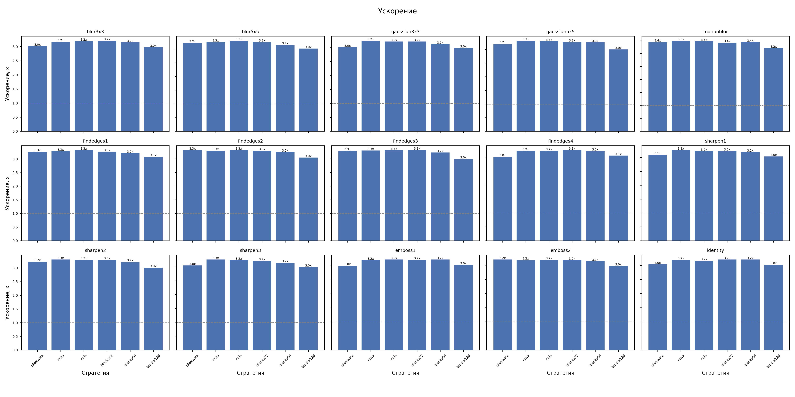
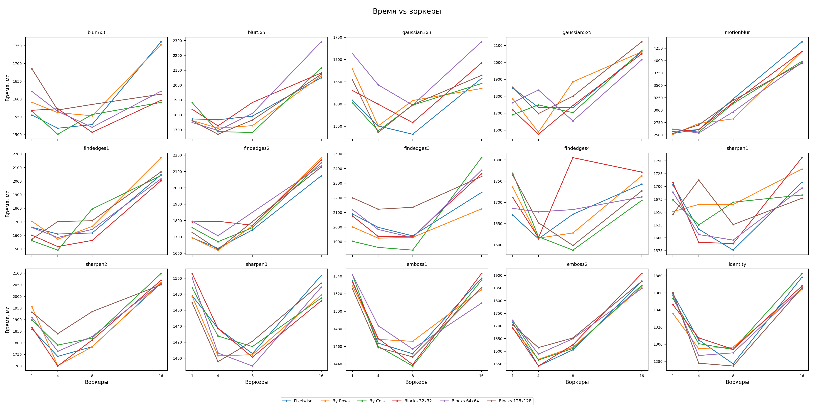
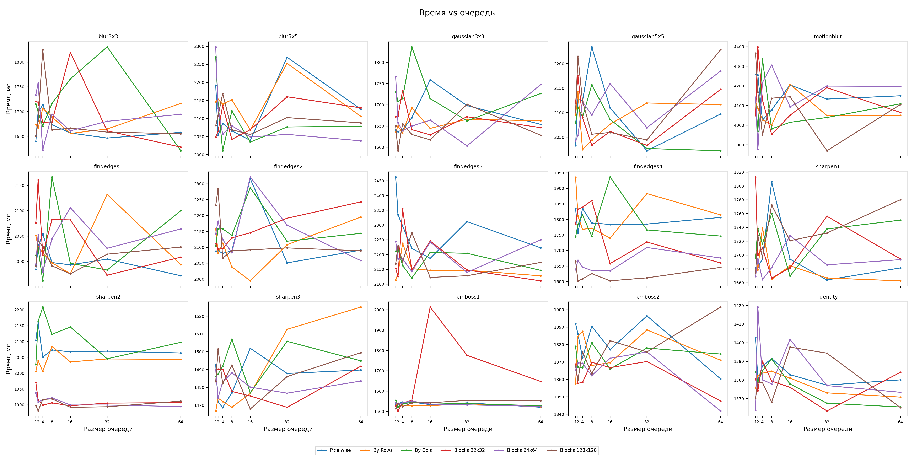

# Convolution Image Filtering (C)

Проект реализует **ручную свёртку (convolution)** для фильтрации изображений на языке C с использованием OpenCV.  
Позволяет применять различные фильтры и тестировать производительность **конвейерной (pipeline) обработки** множества изображений.

---

## Зависимости

Перед сборкой убедитесь, что установлена следующая библиотека:

| Библиотека | Назначение | Сборка |
|------------|------------|---------------------------|
| OpenCV 3.4 | Работа с изображениями через C API | [Инструкция по сборке](https://gist.github.com/ntcuong777/081276a4d609ddfcdc7d139ad02206f9) |

---

## Сборка и запуск (Makefile)

Проект использует `make` для сборки.

### Доступные цели

| Команда | Описание |
|---------|----------|
| `make build` | скомпилировать основную программу |
| `make test` | скомпилировать и запустить тесты |
| `make benchmark` | создает бенчмарки в benchmarks/generated |
| `make clean` | удалить папку `build/` |

### Аргументы командной строки

| Флаг | Длинная форма | Описание | Пример |
|------|---------------|----------|--------|
| `-f` | `--filter` | ID фильтра (0-14) | `-f 2` |
| `-t` | `--tactic` | Стратегия параллелизации (0-6) | `-t 1` |
| `-i` | `--input` | Входная директория с изображениями | `-i images/` |
| `-o` | `--out` | Выходная директория для результатов | `-o results/` |
| `-w` | `--workers` | Количество потоков-воркеров | `-w 4` |

### ID фильтров

| ID | Фильтр | Описание |
|----|--------|----------|
| 0 | `blur3x3` | Размытие 3×3 (крест) |
| 1 | `blur5x5` | Размытие 5×5 (ромб) |
| 2 | `gaussian3x3` | Гауссово размытие 3×3 |
| 3 | `gaussian5x5` | Гауссово размытие 5×5 |
| 4 | `motionblur` | Размытие в движении 9×9 |
| 5 | `findedges1` | Детектор границ (вертикальный) |
| 6 | `findedges2` | Детектор границ (усиленный) |
| 7 | `findedges3` | Детектор границ (диагональный) |
| 8 | `findedges4` | Детектор границ (Лапласиан) |
| 9 | `sharpen1` | Повышение резкости 3×3 |
| 10 | `sharpen2` | Повышение резкости 5×5 |
| 11 | `sharpen3` | Повышение резкости (инверсия) |
| 12 | `emboss1` | Тиснение 3×3 |
| 13 | `emboss2` | Тиснение 5×5 |
| 14 | `identity` | Тождественный фильтр (без изменений) |

### Стратегии параллелизации

| ID | Стратегия | Описание |
|----|-----------|----------|
| 0 | `sequential` | Последовательная обработка |
| 1 | `pixelwise` | Попиксельное распределение |
| 2 | `by_rows` | Разделение по строкам |
| 3 | `by_cols` | Разделение по столбцам |
| 4 | `blocks_32` | Блоки 32×32 |
| 5 | `blocks_64` | Блоки 64×64 |
| 6 | `blocks_128` | Блоки 128×128 |

### Конвейерная обработка

Проект реализует конвейер для потоковой обработки массива изображений. В отличие от последовательной обработки, где каждое изображение полностью загружается, фильтруется и сохраняется перед переходом к следующему, конвейер разделяет процесс на три независимых этапа: чтение, обработку и запись. Эти этапы работают параллельно, что позволяет эффективно использовать ресурсы многоядерного процессора и сокращает общее время обработки набора изображений.

Такой подход особенно эффективен при обработке большого количества изображений или при работе с вычислительно сложными фильтрами, где основное время занимает свёртка. Кроме того, ограниченный размер очередей предотвращает неконтролируемый рост потребления памяти.

### Пример сборки и запуска

```bash
# Клонирование репозитория
git clone https://github.com/Life-enjoyer7/parallel-convolution-Life-enjoyer7
cd parallel-convolution-Life-enjoyer7

# Сборка основной программы
make build

# Запуск конвейера (обработка всех изображений из папки images/)
./build/filter -f 2 -t 1 -i images/ -o results/ -w 4

# Сборка и запуск тестов
make test

```
 
 ---


## Тестовое окружение

Все замеры производительности выполнены на следующей конфигурации:

| Параметр | Значение |
|----------|----------|
| **CPU** | 13th Gen Intel® Core™ i7-13620H |
| **Ядра / потоки** | 10 ядер / 16 потоков |
| **Оперативная память** | 16 ГБ |
| **L1 кэш (данные)** | 416 КБ (10 экземпляров) |
| **L1 кэш (инструкции)** | 448 КБ (10 экземпляров) |
| **L2 кэш** | 9.5 МБ (7 экземпляров) |
| **L3 кэш** | 24 МБ (1 экземпляр) |
| **Кэш-линия** | 64 байта |
| **Операционная система** | Linux 7.0.0-34-generic |
| **Компилятор** | gcc (Ubuntu 13.3.0-6ubuntu2~24.04.1) 13.3.0|


## Бенчмарк

Для оценки масштабируемости конвейерной свёртки измерялась зависимость времени обработки от числа воркеров и от размера очереди между стадиями конвейера. По каждому из 15 фильтров каталога построен отдельный график, на котором нанесены все шесть параллельных стратегий: попиксельное разбиение, построчное, по столбцам и три блочных (32×32, 64×64, 128×128). Последовательная версия на графиках не отображается — она служит лишь точкой отсчёта при расчёте ускорения и представляет собой буквально последовательный проход: цикл по изображениям папки, в котором к каждому кадру по очереди применяется обычный `applyFilter`.

Графиков три: время против числа воркеров (набор 1, 4, 8, 16), время против размера очереди (набор 1, 2, 4, 8, 16, 32, 64) и ускорение каждой параллельной стратегии относительно последовательной версии. На первых двух по вертикали отложено время выполнения в миллисекундах, на третьем — само ускорение. Каждая точка кривой — минимальное (лучшее) время обработки всей папки изображений по серии повторных прогонов: минимум меньше всего страдает от случайных колебаний нагрузки на систему, тогда как медиана по двум прогонам получается слишком шумной.

В отличие от замера одиночной свёртки, здесь измеряется полный проход конвейера по всей папке: чтение изображений, свёртка и запись результата, вместе с накладными расходами на создание очередей, фильтров и потоков. В измеряемое время не входят только подсчёт минимума по повторам и построение самих графиков.

[](benchmarks/generated/speedup_all.svg)

*Рис. 1 — Ускорение параллельных стратегий относительно последовательной версии.*

[](benchmarks/generated/time_vs_workers_all.svg)

*Рис. 2 — Время выполнения в зависимости от числа воркеров.*

[](benchmarks/generated/time_vs_queue_all.svg)

*Рис. 3 — Время выполнения в зависимости от размера очереди.*

## Анализ производительности

Ускорение конвейера сильно зависит от вычислительной сложности фильтра. На лёгких ядрах 3×3 (blur3x3, sharpen1, sharpen3, emboss1, findedges4) и на тождественном фильтре оно держится около 2×, на ядрах 5×5 (blur5x5, gaussian5x5, sharpen2, emboss2, findedges1) поднимается до 2.8–3.2×, а на самом тяжёлом фильтре motionblur 9×9 достигает 4.3×. Это обусловлено тем, что чем дороже свёртка, тем большую долю общего времени она занимает и тем выгоднее её распараллеливать. Абсолютное время последовательной версии на всей папке при этом меняется от 2.8 с (identity) до 13.0 с (motionblur).

Все шесть параллельных стратегий дают практически одинаковый результат: среднее ускорение 2.60–2.61× у попиксельной, построчной и поколоночной и 2.58–2.60× у блочных. Разброс между ними меньше 0.05×, то есть способ разбиения работы здесь почти не важен. Это ожидаемо: узким местом конвейера является не разложение свёртки, а последовательные стадии чтения и записи изображений, которые от выбранной стратегии не зависят.

Наращивание числа воркеров выигрыша не даёт: усреднённое по всем фильтрам и стратегиям время составляет 1747 мс при одном воркере, 1677 мс при четырёх, 1734 мс при восьми и 1994 мс при шестнадцати. Лучшим оказывается режим с четырьмя воркерами, а переход к шестнадцати заметно ухудшает результат. Причина — переподписка: к воркерам добавляются ещё поток чтения и поток записи, а физических ядер на машине всего 10 (6 производительных и 4 энергоэффективных), поэтому потоки начинают конкурировать за ядра и память.

Размер очереди между стадиями почти ни на что не влияет: при переборе от 1 до 64 среднее время держится в диапазоне 1981–1995 мс, то есть меняется в пределах погрешности. Буфер попросту не успевает заполняться — изображений всего 15, а пропускную способность ограничивают последовательные стадии конвейера, а не глубина очереди.

Итог: конвейер ускоряет обработку в 2–4 раза, и величина ускорения определяется тем, насколько дорогая свёртка применяется. Ограничитель здесь — закон Амдала: чтение и запись выполняются в одном потоке и не распараллеливаются, поэтому даже идеально параллельная свёртка не может дать больше, чем позволяет последовательная доля.


